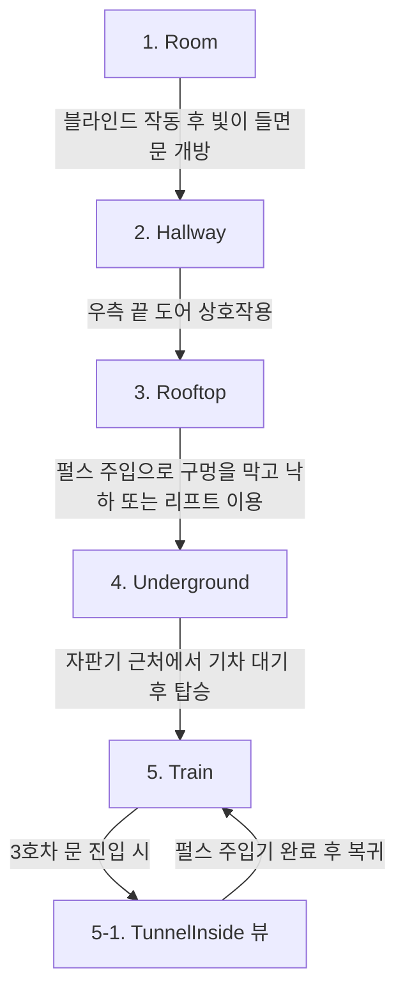

# 게임 맵 구조 및 아키텍처 가이드 (Map Architecture Guide)

본 문서는 프로젝트의 전체 맵 구조, 생명주기(Lifecycle), 맵 간의 상호작용 및 전이 흐름을 기술하여 팀원들이 코드 변경 및 신규 기능 추가 시 참조할 수 있도록 돕습니다.

---

## 1. 전체 구조 개요

게임의 모든 맵 구역은 `MapZone` 열거형으로 정의되며, `GameplayState` 클래스에서 이 구역 상태를 제어하고 업데이트합니다.

```cpp
enum class MapZone { Room, Hallway, Rooftop, Underground, Train };
```

각 맵은 독립된 클래스로 구현되어 있으며, 자신만의 배경 텍스처, 물리적 경계(Hitbox/Collision), 순찰 드론/로봇 관리자, 그리고 맵 특유의 퍼즐 요소(블라인드, 엘리베이터, 물탱크 등)를 소유합니다.

---

## 2. 맵 생명주기 (Lifecycle) 및 호출 흐름

모든 맵은 다음과 같은 공통 인터페이스 메서드 형태를 띠며, `GameplayState`가 현재 속한 구역에 따라 이를 호출합니다.

### 2.1 생명주기 메서드
- **`Initialize()`**: 맵 진입 시 필요한 배경 이미지, 장애물 설정, 드론 및 로봇 스폰 등 리소스를 로드하고 초기화합니다. (기본 맵 데이터는 `MapObjectConfig` 싱글톤을 통해 JSON 설정값 적용)
- **`Update(double dt, ...)`**: 매 프레임 플레이어와의 충돌 판정, 맵 오브젝트의 물리 상태 업데이트, 드론 및 로봇 AI 동작 등을 처리합니다.
- **`Draw(Shader& shader)`**: 메인 스프라이트 및 맵 배경을 렌더링합니다.
- **`DrawDrones / DrawRadars / DrawGauges / DrawDebug`**: 드론 스프라이트, 레이더 범위 원, 체력 게이지 및 디버그 히트박스 레이어를 개별적으로 렌더링합니다.
- **`Shutdown()`**: 맵 종료 또는 게임 오버 시 텍스처 해제 및 동적 할당된 드론/로봇 객체를 메모리에서 해제합니다.

### 2.2 호출 주체: `GameplayState`
- `GameplayState::Initialize()`에서 `m_room`, `m_hallway`, `m_rooftop`, `m_underground`, `m_train`을 각각 `make_unique`로 생성하고 각 맵의 `Initialize`를 수행합니다.
- `GameplayState::Update()` 내에서 현재 `m_currentCheckpoint` 및 `m_trainAccessed` 등의 상태 변수를 기반으로 활성화된 맵의 `Update`를 호출합니다.
- 렌더링 시에는 `GameplayState::DrawMainLayer()`와 `GameplayState::DrawForegroundLayer()`에서 순서에 맞춰 각 맵의 `Draw` 함수를 실행합니다.

---

## 3. 맵 전이 흐름 및 조건

플레이어의 게임 진행 상황에 따라 다음 단계의 맵으로 화면 페이드 효과와 함께 전이가 이루어집니다.



### 전이 조건 및 데이터 흐름:
1. **`Room` ➔ `Hallway`**
   - 플레이어가 블라인드 영역에서 좌클릭(펄스 20 소모)하여 방을 밝게 만듭니다(`m_isBright = true`).
   - 방이 밝아지면 닫혀 있던 우측 도어 오브젝트(`m_door`)가 열리고 플레이어가 도어 충돌체를 벗어나 우측으로 나아가면 `GameplayState`에서 `RoomToHallway` 전이를 시작합니다.
2. **`Hallway` ➔ `Rooftop`**
   - 롱 홀웨이의 우측 끝에 도달하여 옥상 출입 도어(`m_rooftopDoor`)와 플레이어가 충돌하면 `GameplayState`에서 `HallwayToRooftop` 전이가 처리됩니다.
3. **`Rooftop` ➔ `Underground`**
   - 플레이어는 옥상 낙하 구멍을 막는 퍼즐(펄스 5 소모)을 해결하거나, 움직이는 리프트 플랫폼(버튼 작동 시 펄스 8 소모)을 활성화하여 낭떠러지를 건너갑니다.
   - 우측 끝의 지하 통로 입구로 낙하 시 `RooftopToUnderground` 전이가 실행됩니다.
4. **`Underground` ➔ `Train`**
   - 지하철역 구역의 특정 트리거 X 좌표에 도달하면 열차 진입 연출(`m_approachTrain`)이 시작됩니다.
   - 열차가 완전히 멈추고(Docked) 플레이어가 열차 문 위치로 다가가서 탑승하면 `UndergroundToTrain` 전이가 이루어집니다.
5. **`Train` ➔ `TunnelInside` (특수 전환)**
   - 3호차 내부 문으로 진입하면 일시적으로 석양이 어두운 터널 내부 뷰(`m_car3TunnelInsideViewActive = true`)로 전환됩니다.
   - 터널 내부에서 펄스 주입기(`Pulse_1.png`)에 마우스 좌클릭으로 펄스를 주입 완료하면 정지했던 열차가 출발하며, 플레이어가 다시 열차 발판으로 복귀 시 일반 3호차 지붕 뷰로 컴백합니다.

---

## 4. 물리적 충돌 및 플랫폼 이동 처리

각 맵은 플레이어가 화면 경계 밖으로 나가지 못하게 제한하고, 장애물 충돌 시 플레이어 위치를 복구(Resolution)하는 물리 로직을 자체 `Update`에서 직접 수행합니다.

### 4.1 기본적인 AABB 충돌 해결 (Room, Hallway, Underground 등)
- 플레이어의 현재 히트박스 AABB와 장애물 AABB 간 겹침(Overlap) 상태를 검사합니다.
- X축과 Y축 중 더 적은 겹침 폭을 가진 축 방향으로 플레이어 좌표를 강제 밀어냅니다.
  ```cpp
  if (overlapX < overlapY) {
      // 좌/우 밀어내기
  } else {
      // 상/하 밀어내기 (착지 또는 천장 충돌)
  }
  ```

### 4.2 경사면(Ramp) 충돌 처리 (Underground)
- `Underground` 맵의 계단이나 비탈길 등은 경사면 AABB 범위 내에 플레이어 발끝이 올 때 선형 보간(Lerp) 방식으로 Y축 착지 높이를 제어합니다.
  ```cpp
  float localX = (playerFootX - rampLeft) / rampSize.x;
  float targetY = rampBottom + (localX * rampSize.y);
  player.SetPosition({ player.GetPosition().x, targetY + playerHalfSize.y });
  ```

### 4.3 움직이는 발판(Moving Platform) 및 탑승 관성 (Rooftop, Train)
- **`Rooftop::Lift`**: 엘리베이터가 수평으로 이동할 때, 플레이어가 엘리베이터 발판 위에 안착된 상태라면 엘리베이터의 매 프레임 X축 변위량(`deltaX`)만큼 플레이어 좌표에 합산해 줍니다.
- **`Train`**: 기차가 고속으로 질주하는 맵 특성상 플레이어가 공중에 점프하거나 발판에 머물 때 기차 오프셋(`m_trainOffset`) 증가에 따른 카메라 스크롤 가속도 관성(`m_airborneFromTrain`, `m_crouchCarryLatched`)이 플레이어 이동 공식에 적용됩니다.

---

## 5. 은신(Hiding) 및 적 감지 시스템 연계

순찰 드론(`Drone`)은 플레이어가 맵상에 제공되는 은신처 영역 내부에서 웅크린 상태(`Crouch`)일 경우 플레이어를 감지하지 못합니다.

- **은신 판정 함수**: `IsPlayerHiding(Math::Vec2 playerPos, ...)`
  - **Room**: 블라인드 상호작용 구역(`m_blindPos`) 내부에서 웅크릴 시 은신 판정.
  - **Hallway**: 상자나 기계 장치 스프라이트가 제공되는 `m_hidingSpots` 영역에서 은신 판정.
  - **Rooftop**: 은신 불가.
  - **Underground**: 엄폐 장치 근처 `m_hidingSpots` 영역에서 은신 판정.
  - **Train**: 2호차의 보라색 컨테이너 펄스 박스 내부 또는 각 호차별 배치된 엄폐박스(`m_hidingSpots`)에서 은신 판정.

---

## 6. 개발 팀 가이드라인 및 기여 규칙

1. **신규 맵 구역 추가 시**:
   - `MapZone` 열거형과 `PendingTransition`에 새로운 상태를 추가합니다.
   - `GameplayState` 클래스 멤버로 해당 맵의 `unique_ptr`을 선언하고 `Initialize()`, `Update()`, `Draw()` 체인에 등록해야 합니다.
2. **좌표계 적용 주의**:
   - 일반 맵(`Room`, `Hallway`, `Rooftop`, `Underground`)은 정적 월드 좌표계를 기준으로 충돌체를 연산합니다.
   - 반면 `Train` 맵은 기차가 끊임없이 오른쪽으로 전진하므로, 모든 히트박스와 오브젝트 배치는 열차의 초기 좌측 좌표(`MIN_X`)를 원점으로 하는 **로컬 좌표(Local Space)**에 오프셋(`m_trainOffset`)을 더한 동적 월드 좌표를 기준으로 충돌 및 렌더링을 계산해야 합니다.
3. **글로우 아웃라인 렌더링 순서**:
   - 맵 오브젝트의 글로우 효과(`DrawSpriteOutlines`)는 셰이더 깊이 충돌을 예방하기 위해 항상 해당 오브젝트 스프라이트가 전부 그려진 직후 또는 `DrawForegroundLayer` 등 명시적인 렌더링 패스 순서에 맞춰 정렬하여 호출해야 합니다.
